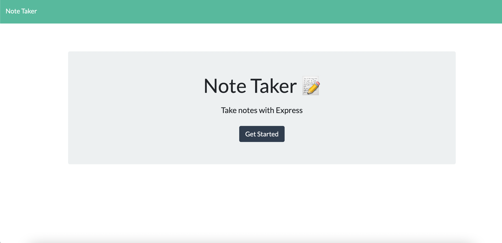
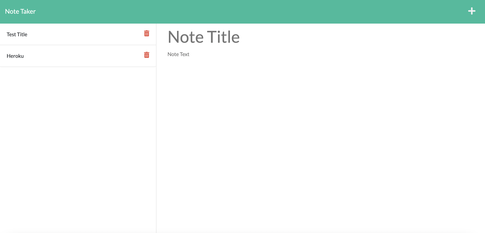

# project Name: NoteTaker-

https://github.com/Elmiratash/NoteTaker-.git

## Description :

This is a simple Note Taker application that allows users to add, view saved notes and also delete the notes if the user don't need that note anymore. This application uses an express backend and save and retrieve note data from a JSON file.

## Table of Contents

- [License](#license)
- [Installation](#installation)
- [Usage](#usage)
- [Contributing](#contributing)
- [Tests](#tests)
- [Questions](#questions)

## License

This project is licensed under the MIT license.

## Installation

Please install these dependencies to run this application: Express.js

## Usage :

Please run node server.js in your terminal and on your browser type http://localhost:3001/, click "Get Started" and enter the note and text, then click save.
Please check these link. https://watch.screencastify.com/v/bcanOwek4dcPj6dOZhAH and https://notetaker-node-et.herokuapp.com/

## Contribution

Pull requests are always welcome!

## Questions

If you have any questions about this projects, please contact me directly at elmira.tashvighi@gmail.com.
You can view more of my projects at https://github.com/Elmiratash.
